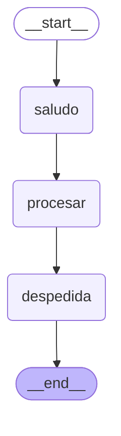

# Ejemplo: State con Pydantic en LangGraph (sin LLMs)

Ejemplo básico que demuestra cómo LangGraph gestiona el **State** usando un modelo **Pydantic**, sin necesidad de LLMs ni APIs externas.

## ¿Qué aprendes?

- ✅ Definir el State de un grafo usando `pydantic.BaseModel`
- ✅ Validación de tipos en tiempo de ejecución
- ✅ Coerción automática de tipos (ej: `"5"` → `5`)
- ✅ Cómo los nodos leen y actualizan el estado
- ✅ Limitaciones conocidas (el output es dict, no Pydantic)

## Conceptos clave

### State con Pydantic

En LangGraph, el `state_schema` puede ser:
- `TypedDict` (más rápido, sin validación)
- `dataclass` (validación básica)
- `pydantic.BaseModel` (validación completa en runtime)

```python
from pydantic import BaseModel, Field

class MiState(BaseModel):
    contador: int = Field(default=0)
    mensajes: list[str] = Field(default_factory=list)
    nombre: str = Field(default="Usuario")
```

### ¿Por qué usar Pydantic?

| Ventaja | Descripción |
|---------|-------------|
| **Validación estricta** | Error inmediato si el tipo es incorrecto |
| **Coerción automática** | Convierte `"42"` → `42` automáticamente |
| **Documentación** | Los `Field(description=...)` documentan el estado |
| **IDE support** | Autocompletado y type hints mejorados |

### Limitaciones conocidas

1. **El output NO es Pydantic**: `graph.invoke()` retorna un `dict`, no una instancia del modelo
2. **Validación solo en el primer nodo**: Los nodos intermedios no validan sus retornos
3. **Performance**: La validación recursiva puede ser lenta en estados grandes

## Estructura del grafo


## Ejecución

```bash
# Desde la raíz del ejemplo
cd ejemplos/ejemplo-state-pydantic

# Crear entorno virtual
python -m venv .venv
source .venv/bin/activate

# Instalar dependencias
pip install -e .

# Ejecutar
python src/agente.py
```

## Salida esperada

```
============================================================
DEMOSTRACIÓN: Validación de Pydantic
============================================================

✅ Estado válido: contador=0 mensajes=[] nombre='Emi'
✅ Coerción automática (contador='5'): contador=5 mensajes=[] nombre='Ana'
   Tipo de contador: <class 'int'>

❌ Error de validación esperado:
   ValidationError: 1 validation error for MiState
   contador
     Input should be a valid integer, unable to parse string as an integer

============================================================
DEMOSTRACIÓN: Ejecución del grafo
============================================================

📥 Estado inicial:
   contador: 0
   mensajes: []
   nombre:   Emi

📤 Estado final (resultado de invoke):
   tipo:     dict
   contador: 3
   nombre:   Emi

   📝 Mensajes generados:
      1. ¡Hola, Emi! Bienvenido al ejemplo de State con Pydantic.
      2. Iteración #1: Procesando con 1 mensajes acumulados.
      3. ¡Adiós, Emi! Se procesaron 2 pasos en total.
```

## Comparación: TypedDict vs Pydantic

```python
# Opción 1: TypedDict (sin validación)
from typing import TypedDict

class StateTypedDict(TypedDict):
    contador: int
    mensajes: list[str]

# Opción 2: Pydantic (con validación)
from pydantic import BaseModel

class StatePydantic(BaseModel):
    contador: int
    mensajes: list[str]
```

**¿Cuál elegir?**
- Usa `TypedDict` si necesitas máximo rendimiento
- Usa `Pydantic` si necesitas validación robusta y documentación


## Diagrama visual 



## Referencias

- [LangGraph: Use Pydantic models for graph state](https://docs.langchain.com/oss/python/langgraph/use-graph-api)
- [Pydantic Documentation](https://docs.pydantic.dev/)
